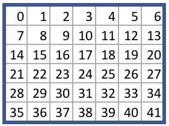
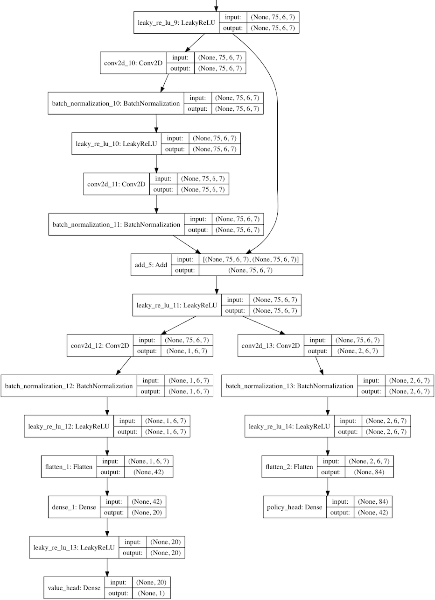
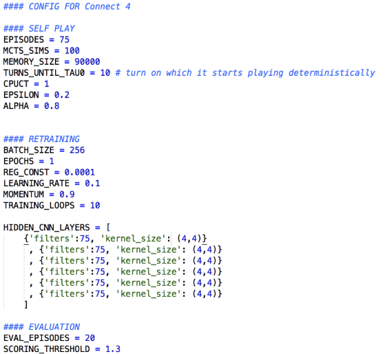

# DeepReinforcementLearning
A replica of the AlphaZero methodology in Python

See this article for a summary of the algorithm and run instructions.

https://applied-data.science/blog/how-to-build-your-own-alphazero-ai-using-python-and-keras/

___

\* Postscript below


# リンク集
ソースコード本家(Python2.7)  
https://github.com/AppliedDataSciencePartners/DeepReinforcementLearning

ソースコードフォーク版(Python3.6)  
https://github.com/jdori/DeepReinforcementLearning

英語版記事  
https://medium.com/applied-data-science/how-to-build-your-own-alphazero-ai-using-python-and-keras-7f664945c188

日本語版記事  
https://postd.cc/applied-data-sciencehow-to-build-your-own-alphazero-ai-using-python-and-keras/

AlphaZeroの詳しめの記事  
http://tim.hibal.org/blog/alpha-zero-how-and-why-it-works/

AlphaGo Zero チートシート  
https://medium.com/applied-data-science/alphago-zero-explained-in-one-diagram-365f5abf67e0


# 記事の要約

## 目次
1. AlphaZeroが人工知能(AI)への大きなステップである2つの理由．
2. AlphaZeroの方法論のレプリカを作ってコネクト4をプレイさせる方法．
3. レプリカを改良して他のゲームをプラグインする方法．


## 歴史
- 2016年3月，AlphaGoが囲碁の18回の世界王者、李世乭(イー・セドル)との5番勝負で4-1で勝利．
  - 囲碁でAIが人間に勝つのは不可能，少なくとも10年は達成できないと言われていた．
- 2017年10月，AlphaGoに100-0で圧勝したAlphaGo Zeroを公開．
  - 白紙状態から自己対戦のみによって学習．
    - プロ棋士による対局のデータベースが必要なくなった．
  - 過去の自分の手に打ち勝つために戦略を段階的に発見．
- 2017年12月，AlphaZeroを公開．
  - 人間の専門家の戦略についての予備知識なく，素早くあることに熟達するための汎用アルゴリズム．


## AlphaZeroの優れている点
1. 人間の知識が全く必要ない．
  - 完全な情報が与えられて入れば，どんなゲームにも応用できる．
  - ゲームの仕組みを記述した入力ファイルを変更し，NNとモンテカルロ木探索に関するハイパーパラメータを微調整するだけ．

2. アルゴリズムがエレガント
  - 前のバージョンよりもずっと簡単なアルゴリズムに．
  - アルゴリズムの概要
    - 考えられる複数のシナリオに沿って頭の中で対局し，有望な経路を優先する．
    - その一方で他のシナリオが自分の打った手にどのように反応するか予想し，未知の部分について検討を続ける．
    - 未経験の状況に至った時は，どのような配置になれば自分にとって好都合なのかを考えて，その配置から現在の配置に至るまでの経路を頭の中で逆に至る．
    - 将来の可能性について考え終わったら，最もよく検討した手を打つ．
    - 対局が終わったら見直して，配置の将来のバリューについてどこで判断を誤ったか評価を行い，それに応じて考え方を修正する


## 各ファイルの役割

### game.py
- connect4のルール  
  - ある手(アクション)を打った時の，状態遷移の論理
- takeAction：ボードとアクションが与えられると，次のボードを返す．
- アクション番号は以下



### run.ipynb
- 学習プロセスを開始するコード
- アルゴリズムのメインループを繰り返す．
  1. 自己対戦
  2. NNの再訓練
  3. NNの評価

- best_player：
  - 最もパフォーマンスの高いNNを持つ．
  - 自己対戦メモリを作るために使用される．

- current_player：
  - 現在のプレーヤー．
  - このメモリを使って自分のNNを再訓練し，best_playerと対戦する．
  - current_playerが勝てば，best_player内のNNがcurrent_player内のNNと入れ替わり，ループが繰り返される．


### agent.py
- Agentクラス
- 各プレーヤーはそれぞれのNNとモンテカルロ木探索で初期化される．

- simulateメソッド：
  - モンテカルロ木探索のプロセスを実行．
  - エージェントが木のフリーノードに移動して，そのノードを自分のNNを評価してから木を上方向に辿りながらノードにバリューを入れていく．

- actメソッド：
  - シミュレーションを何回も繰り返して，現在の配置からどの手を打てば最も好都合か考える．
  - その手を実行に移すために，選択したアクションをゲームに返す．

- replayメソッド：
  - それ以前のゲームのメモリを使ってNNを再訓練．


## model.py
- NNのインスタンスを構築する方法を定めたResidual_CNNクラス．
  - Kerasライブラリを使って，Tensorflowのバックエンドとのネットワークが構築される．
- **AlphaGoZero** の論文に書かれたNNのアーキテクチャの凝縮バージョン．
  - 一つの畳み込み(convolutional)レイヤに多くの残余(residual)レイヤを使い，次にバリューとポリシーのヘッドに別れる．
- 畳み込みフィルタの深さと数は設定ファイルで設定することができる．

- ここの畳み込みフィルタとネットワーク内の緻密に結合したレイヤを見るには，run.ipynbで`current_player.model.viewLayers()`を実行．

- Kerasを使って構築したResNetの例．




### MCTS.py
- モンテカルロ探索木を構成するNode，Edge，MCTSのクラスが入っている．
- MTCSクラスには，前述のmoveToLeafメソッドとbackfillメソッドが入っている．
- Edgeクラスには考えられる手(動作)のそれぞれに関する統計が入っている．


### config.py
- アルゴリズムに影響する重要なパラメータの設定
- 実行時間，NNの正確さ，アルゴリズムの全体的な成功に影響する．

- 以下のパラメータに設定することでアルゴリズムの高速化が可能
  - episodes = 25
  - mcts_sims = 50
  - memory_size = 30000




### funcs.py
- 二つのエージェントを対戦させる，playMatches関数とplayMatchesBetweenFersions関数．
- 自分のプレーヤーと対戦させる場合はrun.ipynbに以下のコードを実行

```
from game import Game
from funcs import playMatchesBetweenVersions
import loggers as lg
env = Game()
playMatchesBetweenVersions(
env
, 1 # the run version number where the computer player is located
, -1 # the version number of the first player (-1 for human)
, 12 # the version number of the second player (-1 for human)
, 10 # how many games to play
, lg.logger_tourney # where to log the game to
, 0 # which player to go first - 0 for random
)
```


### initialize.py
- このアルゴリズムを実行すると，ルートディレクトリのrunフォルダにすべてのモデルとメモリファイルが保存される．
- 後でこのチェックポイントからアルゴリズムを再開するには，runフォルダをrun_archiveフォルダに写し，フォルダ名に実行番号を追加する．次に，run_archiveフォルダ内の該当するファイルの位置に対応するinitialize.pyファイルに実行番号，モデルバージョン番号，メモリバージョン番号を入れ，通常通りにアルゴリズムを実行させると，このチェックポイントから開始する．


### memory.py
- Memoryクラスの，あるインスタンスが以前のゲームのメモリを記憶し，そのメモリをアルゴリズムが使用してcurrent_playerのNNを再訓練する．


### loss.py
- カスタムの損失関数
- 交差エントロピー損失観測に移る前に，反則の手(動作)からの予測結果をマスクする．


### settings.py
- runフォルダとrun_archiveフォルダの場所．


### loggers.py
- ログファイルは，runフォルダ内のlogフォルダに保存される．
- ログ記録をオンにするには，logger_disabled変数の値をFalseに．

- ログファイルを見たければ，このアルゴリズムの働きと，その心の中を理解するために役立つ．
- 各段階でそれぞれの手(動作)に割り当てられた確率がわかる．
- 数日間の訓練で，ミニバッチの繰り返し回数に対する損失が得られる．


## 知見
- 環境のクラス名がGameゆえ，環境を変える場合は全てのGameを変える必要がある(funcs.py内など)．
